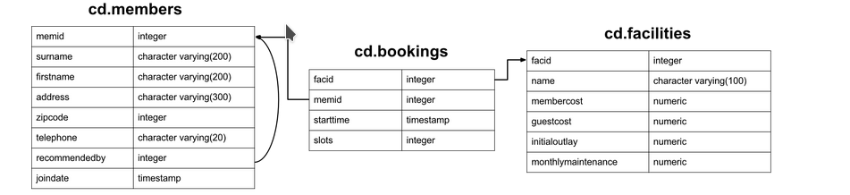

# Database assignments


## Schema

Consider the following schema - 



You can populate the database using this [sql](sql/clubdata.sql).

Now, Please try to answer the following questions - 

## Questions

### 1. Produce a list of costly bookings 

 How can you produce a list of bookings on the day of 2012-09-14 which will cost the member (or guest) more than $30? Remember that guests have different costs to members (the listed costs are per half-hour 'slot'), and the guest user is always ID 0. Include in your output the name of the facility, the name of the member formatted as a single column, and the cost. Order by descending cost, and do not use any subqueries.

 Expected Result:

```
 member     facility    cost
GUEST GUEST     Massage Room 2  320
GUEST GUEST     Massage Room 1  160
GUEST GUEST     Massage Room 1  160
GUEST GUEST     Massage Room 1  160
GUEST GUEST     Tennis Court 2  150
Jemima Farrell  Massage Room 1  140
GUEST GUEST     Tennis Court 1  75
GUEST GUEST     Tennis Court 2  75
GUEST GUEST     Tennis Court 1  75
```

### 2. Delete a member from the cd.members table 

 We want to remove member 37, who has never made a booking, from our database. How can we achieve that?

### 3. Produce a list of member names, with each row containing the total member count

Produce a list of member names, with each row containing the total member count. Order by join date.

### 4. Rank members by (rounded) hours used 

Produce a list of members, along with the number of hours they've booked in facilities, rounded to the nearest ten hours. Rank them by this rounded figure, producing output of first name, surname, rounded hours, rank. Sort by rank, surname, and first name. 

### 5. Calculate a rolling average of total revenue 

For each day in August 2012, calculate a rolling average of total revenue over the previous 15 days. Output should contain date and revenue columns, sorted by the date. Remember to account for the possibility of a day having zero revenue. This one's a bit tough, so don't be afraid to check out the hint! 